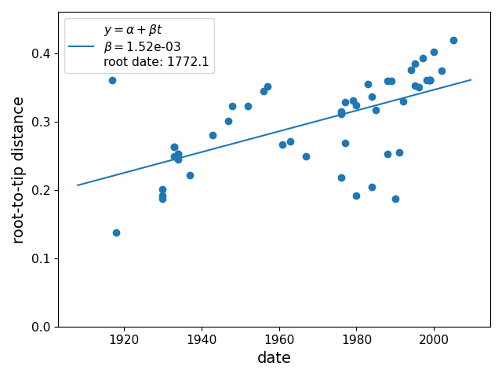
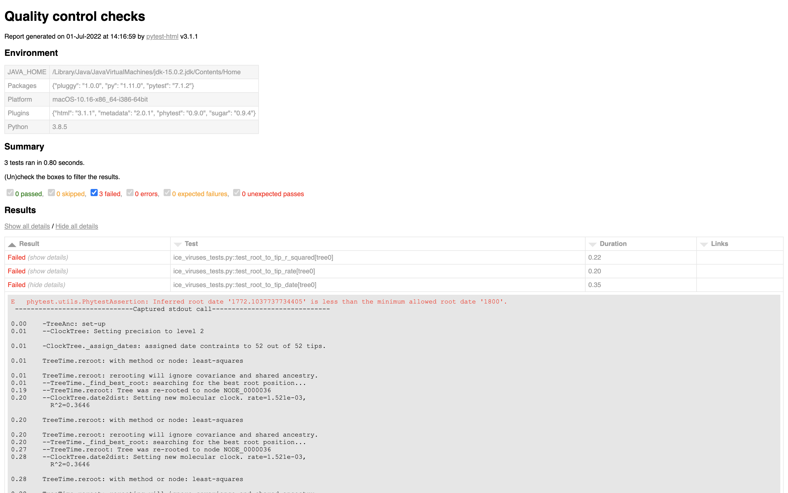
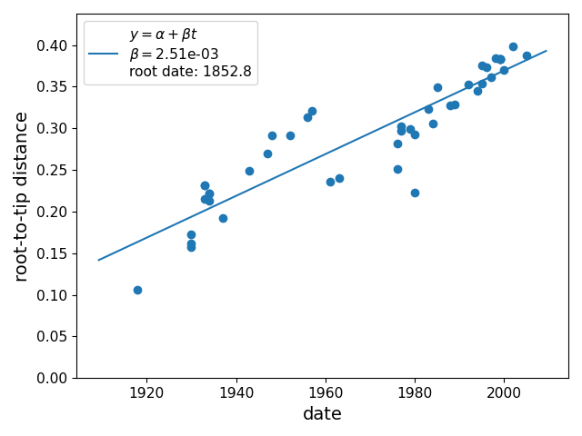

# Temporal signal with Phytest

In this example we use [phytest]() to enure that there is temporal signal in a dataset of sequences sampled through time. Temporal signal analysis is an important step for detecting problematic sequences and potential issues before heading on to a Bayesian phylogenetic analysis (e.g. with [BEAST](https://beast.community/beast)). 

This example uses data from the [TempEst tutorial](https://beast.community/tempest_tutorial). TempEst is a useful program for explore a temporal signal analysis though a GUI, however, it is not possible to automate TempEst. Under the hood Phytest uses [TimeTree](https://github.com/neherlab/treetime) to perform root-to-tip regression allowing us to automate temporal signal testing. Automating this process is especially useful when an analysis is run many times e.g. through development or during daily builds. 

## Setup

Create a python environment

```bash
python3 -m venv venv
```

Activate the environment

```bash
source venv/bin/activate
```

Install `phytest` with pip

```bash
python -m pip install phytest
```

## Tests

In the `ice_viruses_tests.py` file we define the tests that we want to run on our dataset. Phytest is a flexible framework that provides many built in tests and is easily extendable. For simplicity we will focus on a small test set but see the phytest [docs](https://phytest-devs.github.io/phytest/) for more information. 

The focus of this test will be determining if the dataset meets our temporal signal requirements. in the file we file the test below. We want the r squared value of our root-to-tip regression to be greater that 0.5 (this suggest a strong correlation between branch length and sampling date), we want the inferred rate to be between 0.002 and 0.005 (the evolutionary rate of influenza is on the order of 2.8–4.4 × 10^–3), and finally we expect the root date i.e. TMRCA to be in the 19th century.

```python
def test_root_to_tip_r_squared(tree: Tree):
    tree.assert_root_to_tip(min_r_squared=0.5)


def test_root_to_tip_rate(tree: Tree):
    tree.assert_root_to_tip(min_rate=0.002, max_rate=0.005)


def test_root_to_tip_date(tree: Tree):
    tree.assert_root_to_tip(min_root_date=1800, max_root_date=1900)
```

If any of these test fail then then phytest will fail. While these test aren't very strict (we give our-selves a lot of wiggle room) they are still useful for picking up errors before the analysis is run. 

The root-to-tip regression can be plotted with the `tree.plot_root_to_tip` methods e.g. `tree.plot_root_to_tip("root-to-tip.png")`.

## Data

Here we test two data sets from the [TempEst tutorial](https://beast.community/tempest_tutorial). The fist is a uncleaned dataset that contains erroneous data and the second is a cleaned dataset that has the sequences removed.

### Uncleaned 

```pash
phytest ice_viruses_tests.py -a data/ice_viruses.fasta -t data/ice_viruses.fasta.treefile
```



From the output we can see that our tests failed.

```
Results (0.65s):
       3 failed
         - ice_viruses_tests.py:4 test_root_to_tip_r_squared[tree0]
         - ice_viruses_tests.py:8 test_root_to_tip_rate[tree0]
         - ice_viruses_tests.py:12 test_root_to_tip_date[tree0]
```

Using the `--report report.html` flag we can create a detailed report of results. 



### Cleaned 

```bash
phytest ice_viruses_tests.py -s data/ice_viruses_cleaned.fasta -t data/ice_viruses_cleaned.fasta.treefile
```



Using the cleaned dataset all our tests pass, giving us confidence to progress with our analysis. 

```
Results (0.60s):
      3 passed
```
